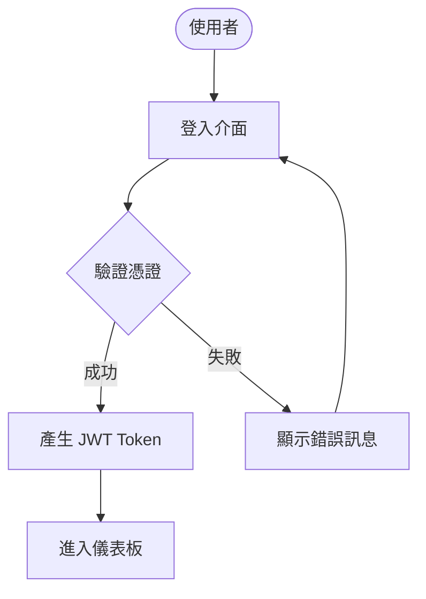
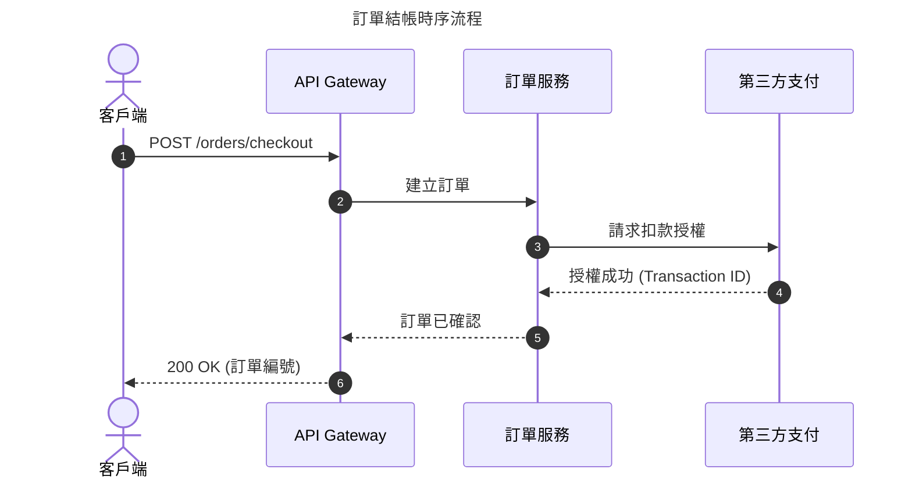
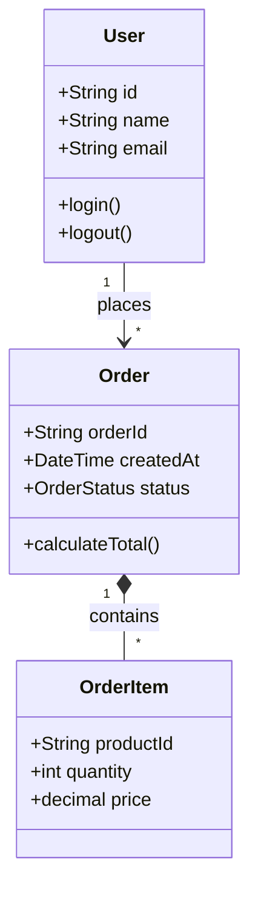

# Markdown Diff Preview & Diagrams 測試文件

這是一份包含多張 Mermaid 圖表的測試文件，用於驗證 Inline 渲染與多 Tab 獨立視圖功能。

## 1. 系統架構流程圖 (Flowchart)

```mermaid
%% title: 使用者認證與授權流程
graph TD
    User([使用者]) --> Login[登入介面]
    Login --> AuthCheck{驗證憑證}
    AuthCheck -->|成功| TokenGen[產生 JWT Token]
    AuthCheck -->|失敗| ShowErr[顯示錯誤訊息]
    TokenGen --> Dashboard[進入儀表板]
    ShowErr --> Login
```

## 2. API 呼叫時序圖 (Sequence Diagram)

```mermaid
---
title: 訂單結帳時序流程
---
sequenceDiagram
    autonumber
    actor Client as 客戶端
    participant Gateway as API Gateway
    participant OrderSvc as 訂單服務
    participant PaymentSvc as 第三方支付

    Client->>Gateway: POST /orders/checkout
    Gateway->>OrderSvc: 建立訂單
    OrderSvc->>PaymentSvc: 請求扣款授權
    PaymentSvc-->>OrderSvc: 授權成功 (Transaction ID)
    OrderSvc-->>Gateway: 訂單已確認
    Gateway-->>Client: 200 OK (訂單編號)
```

## 3. 領域模型類別圖 (Class Diagram)

```mermaid
%% title: 電商系統核心領域模型
classDiagram
    class User {
        +String id
        +String name
        +String email
        +login()
        +logout()
    }
    class Order {
        +String orderId
        +DateTime createdAt
        +OrderStatus status
        +calculateTotal()
    }
    class OrderItem {
        +String productId
        +int quantity
        +decimal price
    }
    User "1" --> "*" Order : places
    Order "1" *-- "*" OrderItem : contains
```
